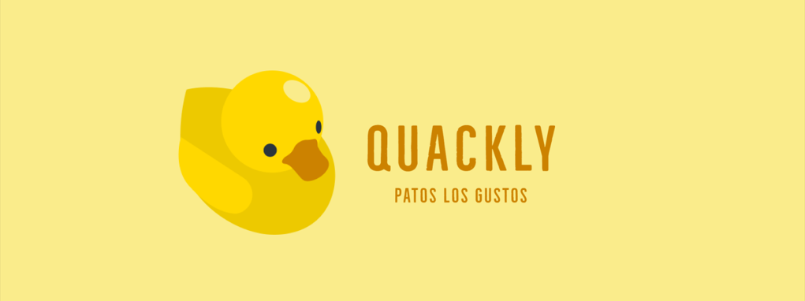

<h2 align="center" class="description">Project Description</h2>
Welcome to QUACKLY, a marketplace that we dive into fun and nostalgia with a unique collection of rubber ducks that will delight your heart. We are the perfect destination for all duck lovers and collectible enthusiasts, offering a wide variety of carefully curated rubber ducks, each with its own vibrant personality and irresistible charm.

<h2 align="center" class="key-features">About QUACKLY</h2>
QUACKLY was born from the idea that a rubber duck can be more than just a desk decoration for developers. Inspired by the famous "rubber duck debugging" technique, where explaining code aloud to a rubber duck helps find errors, we decided to take this practice to the next level. Each DuckCode rubber duck comes with a unique specialty and is equipped with features to aid problem-solving and boost coder productivity.

<h2 align="center" class="key-features">Marketplace</h2>
The marketplace MVP allows users to perform three main actions:

- View all available products: On the marketplace homepage, users can browse through a list of all products available for purchase.

- View a specific product: By clicking on a specific product from the list, users can see the product detail. 

- Search for a product: The marketplace allows users to use a search bar to look for specific products. 

<h2 align="center" class="key-features">Key Features</h2>

### <b>Products Details:</b>
    - Title
    - Description
    - Price
    - Image

### <b>Products list:</b>
    - Image
    - Title
    - Price
 

### 💻 Tools and Technologies
Figma | Visual Studio Code | React | Laravel | PHP | Docker Compose | Mysql

### <b>Developers:</b>

Bea Mendes | Daniel Lopez | Fernando Angulo | Guillermo Rodriguez | Mario Olabe | Melanie Rodríguez | Mireia Vásquez | Nelli Karapetyan | Renata Yumi
